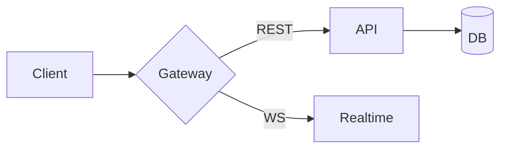

# Ignored H1 (front matter title wins)

```mermaid
flowchart LR
  A[Client] --> B{Gateway}
  B -->|REST| C[API]
  B -->|WS| D[Realtime]
  C --> E[(DB)]
```

> [!WARNING]
> Diagrams render in the browser. TODO: explain the retry policy

Back to [[README]] or [[../README.md]].
